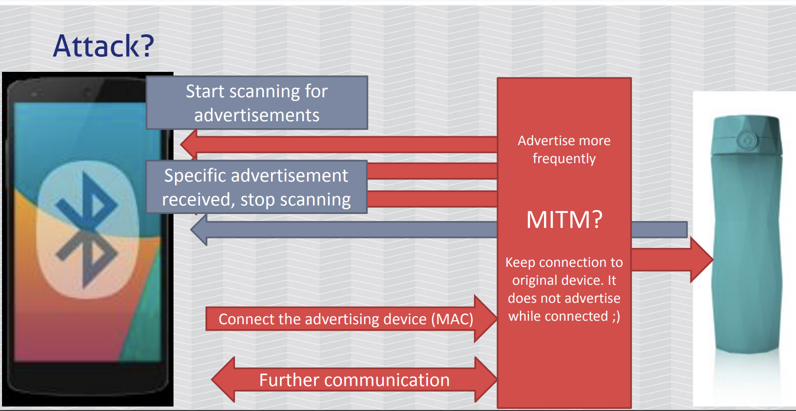

# BLUETOOTH
1. [Các loại Bluetooth](#c1)
2. [Bluetooth Architecture](#c2)
3. [How does Bluetooth work?](#c3)
4. [MITM with Bluetooth](#c4)
5. [Tools](#c5)
## 1. Các loại Bluetooth
Bluetooth hiện nay có 3 loại: Bluetooth Classic (BR/EDR), Bluetooth Low Energy (BLE) và Bluetooth 5.0 (BR/EDR/LE)
- BR/EDR và BLE không tương thích (không giao tiếp) với nhau.
- BR/EDR/LE tích hợp cả hai loại trên, có thể chuyển đổi linh hoạt giữa 2 loại.
- BR/EDR được thiết kế cho các ứng dụng cần truyền dữ liệu lớn và nhanh như: truyền tệp, chơi game,…
- BLE được thiết kế để tiết kiệm năng lượng, có tốc độ truyền thấp hơn, thường dùng trong các thiết bị cần thời gian sử dụng dài như: chuột, bàn phím, tai nghe không dây, các thiết bị IoT…

## 2. Bluetooth Architecture
Gồm 3 phần: Controller (Phần cứng), Host (Phần mềm) và lớp Application:
- Controller:
	- Physical Layer (PHY): là lớp thấp nhất, chịu trách nhiệm cho việc truyền dữ liệu qua sóng vô tuyến.
	- Link Layer/Manager chịu trách nhiệm quản lý kết nối giữa các thiết bị BLE, nó còn chịu trách nhiệm phân nhỏ dữ liệu để gửi đi cũng như tái kết hợp chúng lại.
- HCI (Host Controller Interface): cung cấp giao diện để giao tiếp giữa Host và Controller.
- Host:
	- L2CAP (Logical Link Control and Adaptation Protocol): cung cấp các dịch vụ, giao thức để các ứng dụng giao tiếp với nhau.
	- GATT: cung cấp các chức năng như quét dịch vụ, kết nối dịch vụ, đọc và viết đặc tính.
	- ATT: cung cấp các giao thức để GATT hoạt động.
	- SMP: cung cấp các dịch bảo mật như trao đổi khóa bảo mật, xác thực, mã hóa.
	- GAP: cung cấp các chức năng cơ bản như quét, kết nối, quản lý kết nối.
- Application Layer: cung cấp các dịch vụ chung cho các ứng dụng để giao tiếp với thiết bị BLE khác. Các dịch vụ này được thực hiện bởi Host và Controller. Lớp này tương tự như OS trên máy.

## 3. How does Bluetooth work?

- Sử dụng sóng radio băng tần 2,4GHz - 2,4835GHz, chia thành 79 channels ở BR/EDR và 40 channels ở BLE, 2 thiết bị giao tiếp với nhau bằng cách gửi các packet qua các channel này.

- Khi các thiết bị liên lạc với nhau, chúng không hoạt động ở một kênh duy nhất mà nhảy tần số liên tục (1600 lần/s) để nhiều thiết bị có thể hoạt động bình thường khi ở gần nhau, và bảo mật hơn khi trao đổi dữ liệu.
- Chỉ có 2 thiết bị đang giao tiếp mới biết được trình tự các channels mà chúng sẽ dùng.

- Khi truyền dữ liệu, thiết bị sẽ chia data thành nhiều packet nhỏ và gửi đi (bởi Link Layer).
- Một packet của Bluetooth có 3 thành phần: Access Codes, Header và Payload.
	- Access Codes: có kích thước cố định là 72 bit. Nó được sử dụng để đồng bộ dữ liệu, định danh, và báo hiệu.
	- Header: có kích thước cố định là 54 bit. Nó chứa các thông tin về loại packet, kiểu mã hóa, address và Integrity check (kiểm tra tính toàn vẹn - để phát hiện lỗi dữ liệu).
	- Payload: phần này chứa dữ liệu được truyền, kích thước có thể thay đổi từ 0 đến 2744 bit.

- Xem một ví dụ để hiểu hơn:
	> Khi một điện thoại muốn kết nối với airpod, điện thoại sẽ gửi một packet quảng cáo (advertise) có chứa access code ngẫu nhiên. Airpod sẽ sử dụng access code này để đồng bộ hóa dữ liệu và xác định điện thoại, cũng như lấy địa chỉ MAC của điện thoại từ phần header. Nếu airpod chấp nhận kết nối, nó sẽ gửi một packet phản hồi có chứa access code ngẫu nhiên khác (Access code của mỗi packet đều sẽ được random).
## 4. MITM with Bluetooth
- Một kết nối bluetooth thông thường:
  	- Thiết bị 1 phát các gói "advertisement" ra xung quanh.
  	- Thiết bị 2 phát hiện ra thiết bị 1 bằng cách quét các gói "advertisement" xung quanh.
  	- 2 thiết bị kết nối với nhau.

- Khi tấn công MITM:
  	- Attacker quét các gói "advertisement" của thiết bị 1, sao chép gói đó và kết nối với thiết bị 1.
  	- Khi đã kết nối, thiết bị 1 không còn phát các gói "advertisement" nữa.
  	- Attacker dùng gói "advertisement" đã đánh cắp để giả mạo thiết bị 1, phát các gói giả mạo ra xung quanh.
  	- Thiết bị 2 quét được gói "advertisement" giả mạo và kết nối với attacker.
  	- Kết quả: attacker đứng giữa, chuyển tiếp thông tin khi 2 thiết bị giao tiếp với nhau.

## 5. Tools
- **hciconfig**
	- `hciconfig` hiển thị các adapter Bluetooth có trên máy.
	- `sudo hciconfig -a hciX up` kích hoạt adapter hciX, X là một con số tùy theo adapter mà bạn dùng.
	- `sudo hciconfig -a hciX reset` reset adapter
	
	
	
- **hcitool**
	- `hcitool -i hciX scan` quét các thiết bị bluetooth xung quanh.
	- `sudo hcitool info <MAC>` lấy thông tin của thiết bị có địa chỉ \<MAC>.
	
	

- **bettercap**
	- `sudo apt install bettercap` cài đặt.
	- `sudo bettercap` mở giao diện của bettercap.
	- `ble.recon on` bắt đầu quét thiết bị BLE xung quanh.
	- `ble.show show` các thiết bị đã quét được.
	- `ble.enum <MAC>` liệt kê thông tin của thiết bị với địa chỉ \<MAC>.
	- `ble.write <MAC> <UUID> <HEX_DATA>` ghi dữ liệu \<HEX_DATA> vào dịch vụ \<UUID> của thiết bị \<MAC>.

	
- **GATTacker**
