# GPS
[I. KHÁI NIỆM](#c1)

- [A. GPS là gì?](#c2)

- [B. Các thành phần của GPS (Structure)](#c3)
  - [1. Phần không gian (Space segment)](#c4)
  - [2. Phần điều khiển (Control segment)](#c5)
  - [3. Phần người dùng (User segment)](#c6)

[II. Nguyên lý hoạt động của GPS](#c7)
- [A. Phép đo tam giác (Trilateration)](#c8)
  - [1. Trong không gian 2 chiều](#c9)
  - [2. Trong không gian 3 chiều](#c10)

- [B. Làm thế nào để tính khoảng cách từ máy nhận đến vệ tinh?](#c11)
  - [1. Công thức tính](#c12)
  - [2. Sai số](#c13)
## I. KHÁI NIỆM
### A. GPS là gì?
- GPS là viết tắt của Global Positioning System, hay Hệ thống định vị toàn cầu, là một hệ thống định vô tuyến dựa trên vệ tinh, được phát triển và vận hành bởi chính phủ Mỹ.
- GPS ban đầu được phát triển với mục đích quân sự, sau này được dùng để phục vụ dân sự.
- Hiện nay có 2 hệ thống định vị toàn cầu là GPS (Mỹ) và GLONASS (Nga).
### B. Các thành phần của GPS (Structure)
Hệ thống GPS gồm 3 phần chính: Phần không gian (Space segment), Phần điều khiển (Control segment), Phần người dùng (User segment).
#### 1. Phần không gian (Space segment)
- Gồm ít nhất 24 vệ tinh bay ở độ cao 20.184km, với chu kỳ là 11h58’ (hiện nay có 31 vệ tinh đang hoạt động và 4 vệ tinh dự phòng).
- Các vệ tinh này nằm trên 6 mặt phẳng quỹ đạo với ít nhất 4 vệ tinh hoạt động trên mỗi mặt phẳng. Các mặt phẳng cách nhau 60 độ về kinh độ và nghiêng 55 độ so với mặt phẳng xích đạo.

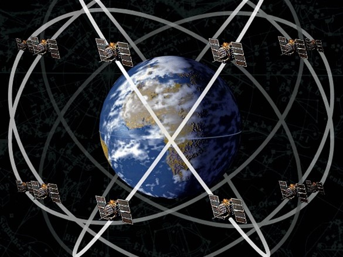
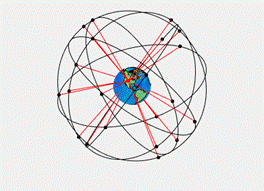

#### 2. Phần điều khiển (Control segment)
Gồm trạm điều khiển chính (Master control station), các trạm giám sát (Monitor stations) và các anten mặt đất (Ground Antennas):
	- Các trạm giám sát theo dõi và thu thập dữ liệu từ vệ tinh (dữ liệu quỹ đạo, vận tốc, khoảng cách đến vệ tinh, đồng hồ vệ tinh), sau đó truyền dữ liệu đến trạm điều khiển chính.
	- Trạm điều khiển chính: nhận dữ liệu từ các trạm giám sát, kiểm tra sự chính xác của dữ liệu và sửa lại nếu cần, định dạng dữ liệu trong tin nhắn điều hướng và gửi chúng cho các anten mặt đất. Trạm điều khiển chính cũng có thể kích hoạt bất cứ vệ tinh dự phòng nào nếu cần thiết.
	- Các anten mặt đất: nhận tín hiệu điều hướng từ trạm điều khiển chính và gửi chúng cho vệ tinh.
#### 3. Phần người dùng (User segment)
Là các thiết bị nhận và dùng tín hiệu GPS để định vị như điện thoại, máy định vị GPS, máy bay, tàu thuyền...
## II. Nguyên lý hoạt động của GPS
### A. Phép đo tam giác (Trilateration)
Là phép đo dùng 3 điểm tham chiếu để xác định tọa độ của 1 điểm
#### 1. Trong không gian 2 chiều
- Khi có1 điểm tham chiếu: vị trí của điểm cần tìm (điểm màu đỏ) có thể nằm ở bất cứ đâu trên vòng tròn có tâm là điểm tham chiếu (Point 1), bán kính là khoảng cách giữa 2 điểm đó.

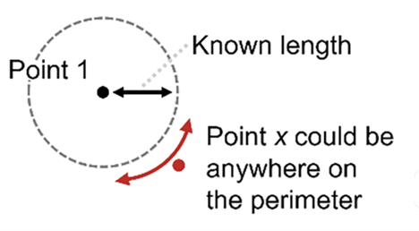

- Khi có điểm tham chiếu thứ 2: điểm cần tìm sẽ là 1 trong 2 điểm giao nhau của 2 đường tròn.

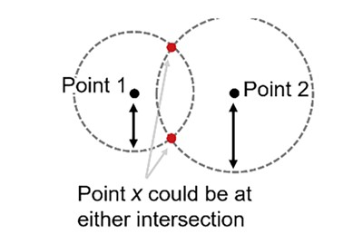

- Khi có điểm tham chiếu thứ 3: sẽ xác định được vị trí chính xác của điểm cần tìm, là điểm giao nhau của 3 đường tròn.

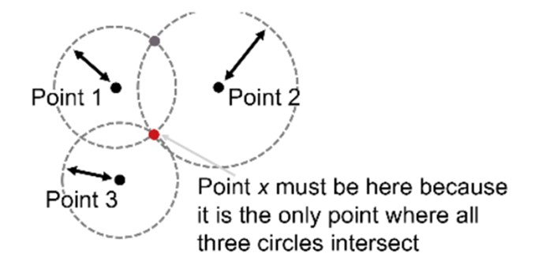

#### 2. Trong không gian 3 chiều
- Hệ thống GPS sử dụng cách trên để định vị một điểm, nhưng khác nhau là trong không gian 3 chiều thay vì 2 chiều, vậy nên đường tròn ở giả thiết trên sẽ trở thành hình cầu.
- Khi 3 hình cầu giao nhau sẽ có đến 2 vị trí giao, nên GPS sẽ dựa vào khoảng cách của 2 điểm đến tâm Trái Đất để loại đi 1 điểm (điểm nào xa tâm TĐ hơn thì loại).

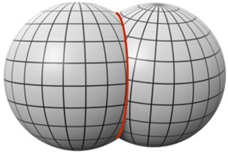
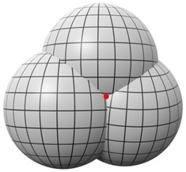
### B. Làm thế nào để tính khoảng cách từ máy nhận đến vệ tinh?
#### 1. Công thức tính
- Công thức tính: S = V*T
- Trong đó:
	- S là khoảng cách từ máy nhận đến vệ tinh
	- V là vận tốc tín hiệu sóng vô tuyến
	- T là thời gian sóng truyền từ vệ tinh đến máy nhận
- Sóng vô tuyến cũng như các loại sóng điện từ khác, chúng truyền với vận tốc ánh sáng (299.792.458m/s)
- Thời gian tín hiệu truyền từ vệ tinh đến máy nhận (T) được tính như sau:
	- Vệ tinh gửi tín hiệu chứa thông tin về thời gian gửi
	- Máy nhận thu tín hiệu và so sánh thời gian nhận với thời gian gửi để tính T
- Có thể viết lại công thức như sau:
	- `Khoảng cách = Tốc độ ánh sáng * (Thời gian nhận - Thời gian gửi)`
#### 2. Sai số
- Tuy nhiên, trong thực tế vệ tinh sử dụng đồng nguyên tử có độ chính xác cao, còn máy thu thì sử dụng đồng hồ thạch anh với độ chính xác thấp hơn, nên thời gian giữa 2 bên sẽ có sai số.
- Hãy xem ảnh hưởng của sai số đến sự chính xác của GPS qua ví dụ dưới:
	- Giả sử thời gian thực tế tín hiệu truyền đi là 0.07 giây, ta sẽ tính được `S = 299.792.458 * 0.07 = 20.985km & 472m`
	- Nếu thời gian trên máy thu lệch đi 1 phần triệu giây so với vệ tinh, nghĩa là T = 0.070001 giây, lúc đó `S = 299.792.458 * 0.070001 = 20.985km & 772m`, lệch đi tận 300m so với thực tế.
- Đây là khi thời gian của 2 đồng hồ giống nhau:

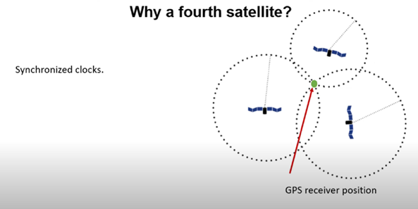
- Và đây là khi bị lệch 1 phần triệu giây:

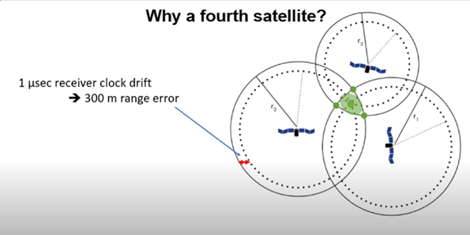
- Đó là lý do cần phải sử dụng đến vệ tinh thứ 4 để cải thiện độ chính xác xuống 5m đến 10m.
- Một số yếu tố khác ảnh hưởng đến độ chính xác của GPS như: bầu khí quyển, phản xạ sóng, vị trí vệ tinh, ephemeris error.

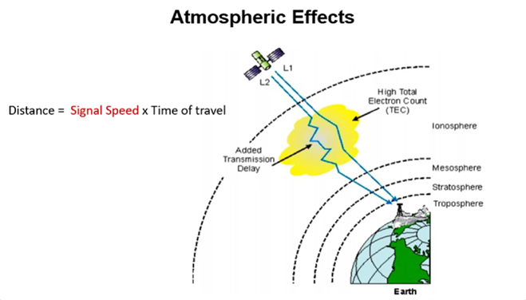
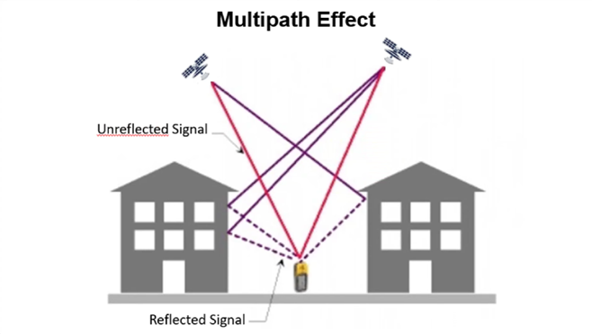
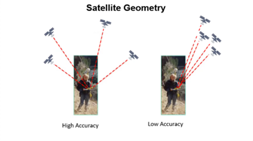
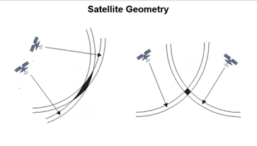
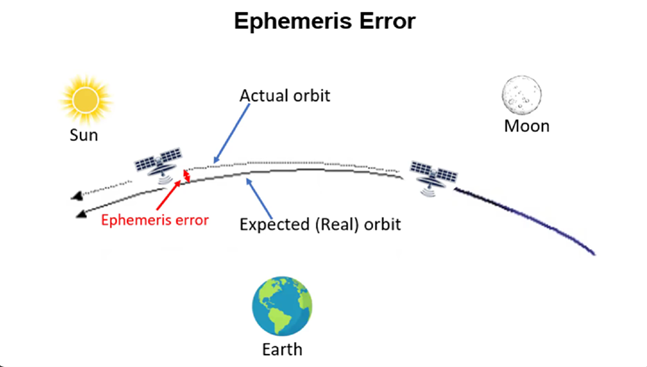
